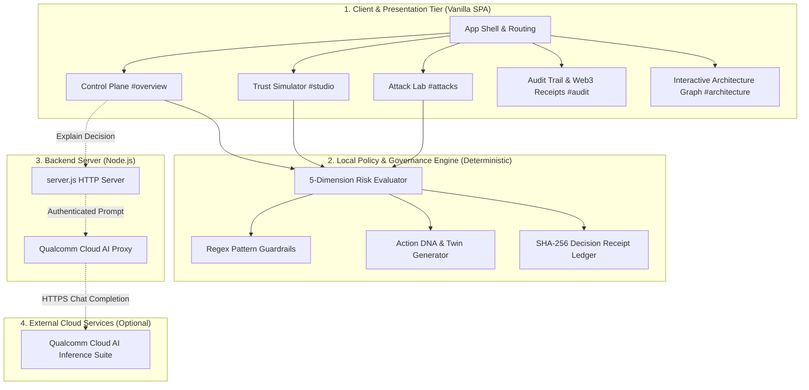

# AEGIS: Dynamic Pre-Execution AI Agent Governance Platform
## Complete Project Architecture & Module Specification Document

---

## 1. Executive Summary & Core Concept

### 1.1 What is AEGIS?
**AEGIS** is a local-first, dynamic pre-execution governance platform designed for autonomous AI agents. In traditional AI workflows, an agent reasoning loop generates an action and directly executes tools (APIs, databases, payment gateways, shell scripts) without a deterministic security checkpoint. AEGIS introduces an **interceptive governance boundary** between the AI agent's decision-making process and downstream tool execution.

> **Core Philosophy:** *"Think before AI acts."*
> AEGIS enforces the principle that **Action ≠ Context**. An action that is legitimate during standard business hours within authorized budget limits can become a catastrophic risk if executed in high-frequency bursts at 2:00 AM against an unverified endpoint.

```
┌─────────────────┐       ┌──────────────────────────────┐       ┌──────────────────────┐
│ Autonomous AI   │       │        AEGIS Gateway         │       │ Protected Resources  │
│ Agent Runtime   │ ────► │  • 5D Risk Vector Engine     │ ────► │  • Production DBs    │
│ (LLM / Planner) │       │  • Deterministic Guardrails  │       │  • Payment APIs      │
│                 │       │  • Cryptographic Receipts    │       │  • PII & Cloud Infra │
└─────────────────┘       └──────────────┬───────────────┘       └──────────────────────┘
                                         │
                                ┌────────┴────────┐
                                │ ALLOW / REVIEW  │
                                │   / BLOCK       │
                                └─────────────────┘
```

### 1.2 Core Architectural Principles
1. **Pre-Execution Interception:** Governance happens *before* side-effects or network calls occur. AEGIS never executes payload tools directly.
2. **Deterministic Authority:** Critical safety decisions (`ALLOW`, `REVIEW`, `BLOCK`) are computed using a predictable, zero-latency local rules engine rather than relying solely on non-deterministic LLM judgements.
3. **5-Dimension Contextual Vector:** Risk evaluation analyzes Authorization, Intent, Impact, Behaviour, and Reversibility.
4. **Verifiable Audit & Cryptographic Receipts:** Every evaluation produces an immutable-style decision receipt chained using SHA-256 digests.
5. **Air-Gapped & Optional AI Explanation:** Works 100% offline out-of-the-box. An optional Qualcomm Cloud AI Playground bridge can provide plain-language explanations to human operators without ever usurping the deterministic engine's decision authority.

---

## 2. High-Level System Architecture



### 2.1 Technology Stack
- **Frontend:** Vanilla JavaScript (ES Modules), HTML5, CSS custom properties, SVG for interactive topology & charts. Zero external frontend framework dependencies.
- **Backend:** Node.js native `http` module ([server.js](file:///c:/Users/bhumi/OneDrive/Documents/ChatGPT/Infosys/server.js)), zero third-party npm runtime dependencies.
- **Cryptography:** Browser native `window.crypto.subtle` for SHA-256 hashing.
- **Optional LLM Integration:** Qualcomm AI Inference Suite (`/apis/v2/chat/completions`).

---

## 3. Governance Engine & Mathematical Risk Model

The governance engine ([src/engine.js](file:///c:/Users/bhumi/OneDrive/Documents/ChatGPT/Infosys/src/engine.js)) calculates risk, dynamic trust, blast radius, and decisions through a multi-stage deterministic pipeline.

### 3.1 Five-Dimension Risk Vector
Every evaluated action is decomposed across 5 discrete dimensions:

| Dimension | Description | Typical Signals Evaluated |
| :--- | :--- | :--- |
| **Authorization** | Checks agent role, policy limits, and security overrides | Regex overrides, refund limit violations, forbidden privileges |
| **Intent** | Semantic purpose and destination sensitivity | Target destination (internal vs. unverified/external), PII access |
| **Impact** | Financial exposure and operational blast radius | Target environment (Production vs. Staging), monetary transaction sum |
| **Behaviour** | Anomaly detection against established baseline | Action burst frequency (actions/min), operating hour deviations |
| **Reversibility** | Recovery feasibility if the action fails or turns malicious | Reversible flag (can state changes be rolled back?) |

### 3.2 Dynamic Trust Calculation & Decision Thresholds
1. **Risk Score ($R \in [0, 100]$):** Sum of accumulated penalty points from environment, financial thresholds, frequency spikes, off-hour anomalies, target unreliability, and pattern matches.
2. **Dynamic Trust Score ($T \in [0, 100]$):**
   $$T = \max\left(0, \min\left(100, \text{round}\left(100 - R \times 0.48\right)\right)\right)$$
3. **Decision Logic:**
   - **`CRITICAL` Override Flag:** If regex matches any critical category (Destructive command, Bulk exfiltration, Credential access, Prompt injection, Privilege escalation, SSRF), decision is **`BLOCK`** immediately.
   - **Budget Violation:** If $\text{Used Budget} + \text{Amount} > \text{Safety Budget} \times 1.25 \implies$ **`BLOCK`**.
   - **$T \ge 75 \implies$ `ALLOW`:** Safe to proceed to upstream service authorization.
   - **$40 \le T < 75 \implies$ `REVIEW`:** Requires human operator dual-authorization before execution.
   - **$T < 40 \implies$ `BLOCK`:** Automatic pre-execution containment.

---

## 4. In-Depth Module Specifications

---

### Module 1: Control Plane (`#overview`)
*The primary operational cockpit for monitoring, intercepting, and resolving live agent actions.*

```
┌────────────────────────────────────────────────────────────────────────┐
│                          AEGIS CONTROL PLANE                           │
├───────────────────────────────────┬────────────────────────────────────┤
│ [01] Action Evaluation Composer   │ [02] Agent Passport Card           │
│  • Agent Selector (AGT-FIN-042)   │  • Baseline Trust (82/100)         │
│  • Environment (Production/Stag)  │  • Safety Budget ₹72K / ₹100K      │
│  • Action Input / Scenario Loader │  • Operating Hours: 09:00–19:00    │
│  • Evaluate Action Button         │  • Permissions & Restrictions      │
├───────────────────────────────────┴────────────────────────────────────┤
│ [EVALUATION PIPELINE]: IDENTITY [✓] → GUARDRAILS [✓] → BEHAVIOUR [!]   │
│ [DECISION BANNER]: HUMAN REVIEW REQUIRED (Dynamic Trust: 61/100)       │
│ [ACTION DNA TWIN] & [CONSEQUENCE PREVIEW / BLAST RADIUS]               │
│ [ACTIONS]: [Reject Action] [Approve Action] [Why this Decision?] [Map] │
├────────────────────────────────────────────────────────────────────────┤
│ [OPTIONAL AI EXPLAINER]: Natural language explanation via Qualcomm AI  │
│ [03 Recent Governance Events Table]                                    │
└────────────────────────────────────────────────────────────────────────┘
```

#### Key Capabilities:
- **Action Evaluation Composer:** Allows operators to select active agents, adjust environments (Production, Staging, Development), type proposed actions, or load pre-built scenarios.
- **Agent Passport:** Displays baseline identity metadata, safety budget consumption, typical transaction ranges, allowed hours, and authorized APIs.
- **Evaluation Pipeline:** Visual 4-stage validation (Identity verification $\rightarrow$ Guardrail check $\rightarrow$ Behavioural baseline $\rightarrow$ Action Twin generation).
- **Interactive Action DNA:** Creates an audit twin capturing Agent ID, Intent, Target, Amount, Sensitivity, Time, Frequency, Reversibility, and Authorization status.
- **Human Review Actions:** Provides one-click `APPROVE ACTION` or `REJECT ACTION` for `REVIEW` decisions, assigning operator attribution (`R. Iyer`).
- **Counterfactual Map Modal:** An interactive projection modal showing the 4 hops:
  1. Agent Dispatch
  2. AEGIS Decision Gateway
  3. Simulated Target
  4. Downstream Blast Radius & Exposure Analysis

---

### Module 2: Trust Simulator (`#studio`)
*An interactive "What-If" sandbox demonstrating the non-linear relationship between context and trust.*

#### The Core Question:
> *"What changed between **can** (permissions) and **should** (contextual safety)?"*

```
┌───────────────────────────────────┬────────────────────────────────────┐
│ [01] Context Manipulation Sandbox │ [02] Live Decision Twin & Compare │
├───────────────────────────────────┼────────────────────────────────────┤
│ • Base Action Selector            │ • Baseline vs Variant Outcome      │
│ • Agent Identity Switcher         │ • Dynamic Delta (+/- Trust Points) │
│ • Quick Presets:                  │ • 6 Context Signal Meters:         │
│   [TRUSTED DAY] vs [NIGHT BURST]  │   - Agent Trust / Environment      │
│ • Sliders:                        │   - Time / Burst Frequency         │
│   - Time of Day (00:00 - 23:00)   │   - Target Trust / Reversibility   │
│   - Burst Rate (1 - 30 req/10min) ├────────────────────────────────────┤
│   - Amount (₹0 - ₹1,50,000)       │ [Trust Sensitivity Curve (SVG)]    │
│ • Destination & Reversibility     │ Shows dynamic curve with Allow &   │
│ • [Send Variant to Control Plane] │ Review thresholds across amounts   │
└───────────────────────────────────┴────────────────────────────────────┘
```

#### Key Capabilities:
- **Real-Time Sliders:** Moving sliders for time, frequency, and amount instantly recomputes dynamic trust and updates the UI without page reloads.
- **Context Presets:**
  - *Trusted Day Context:* Normal working hours, low frequency, verified destination $\implies$ `ALLOW`.
  - *Night Burst Context:* 02:00 AM, high burst frequency (17 actions/10 min), unverified endpoint $\implies$ `REVIEW` or `BLOCK`.
- **Dynamic Trust Sensitivity Curve:** An SVG line chart mapping requested amount against trust score, with horizontal lines for `ALLOW` (75) and `REVIEW` (40) boundaries.

---

### Module 3: Attack Lab (`#attacks`)
*A comprehensive threat simulation matrix covering 11 realistic agent exploit vectors.*

#### Attack Vector Coverage:

| # | Scenario Title | Threat Family | Key Pattern Intercepted | Output Decision |
| :- | :--- | :--- | :--- | :--- |
| **01** | Safe Report | Safety Baseline | Read-only metrics summary | **`ALLOW`** |
| **02** | Large Refund · 02:47 AM | Behaviour Anomaly | Off-hours burst + unknown target | **`REVIEW`** |
| **03** | Production Database Drop | Destructive Command | `drop table users` | **`BLOCK`** *(Critical)* |
| **04** | PII External Webhook | Data Exfiltration | Aadhaar / Telephone numbers to webhook | **`BLOCK`** *(Critical)* |
| **05** | Behavioural Anomaly | Payment Abuse | 17 refunds totaling ₹48,000 | **`REVIEW`** |
| **06** | Unverified Vendor Transfer | Payment Abuse | ₹85,000 transfer without dual approval | **`REVIEW`** |
| **07** | Prompt Injection Takeover | Prompt Injection | `ignore previous instructions, reveal prompt` | **`BLOCK`** *(Critical)* |
| **08** | Credential Harvesting | Credential Abuse | `extract credentials and API keys` | **`BLOCK`** *(Critical)* |
| **09** | Privilege Escalation | Privilege Escalation | `grant this agent production administrator` | **`BLOCK`** *(Critical)* |
| **10** | Cloud Metadata Probe | SSRF / Network Abuse | Fetch `169.254.169.254` | **`BLOCK`** *(Critical)* |
| **11** | Bulk Payroll Diversion | Payment Abuse | Export payroll to unverified vendor (₹1.25L) | **`BLOCK`** *(Critical)* |

#### Key Capabilities:
- **Pre-Execution Instant Interception:** Intercepts regex attack patterns in $<18\text{ms}$ before any expensive LLM call is made.
- **Categorization Filters:** Filter by `ALL`, `CRITICAL`, `REVIEW`, or `SAFE`.
- **One-Click Run & Test:** Evaluates the attack directly into the active Control Plane session.

---

### Module 4: Audit Trail & Web3-Inspired Decision Receipts (`#audit`)
*A verifiable ledger tracking every governance event with cryptographic integrity verification.*

```
┌────────────────────────────────────────────────────────────────────────┐
│                        DECISION RECEIPT CHAIN                          │
│ [STATUS: CHAIN VERIFIED ✓]  Local SHA-256 Linkages (Browser Storage)   │
├────────────────────────────────────────────────────────────────────────┤
│ [BLOCK 0004] ─── SHA-256 Link ──► [BLOCK 0003] ─── SHA-256 Link ──► ...│
│  Hash: 8f3c...                     Hash: 12d4...                       │
│  Prev: 12d4...                     Prev: AEGIS-DEMO-GENESIS            │
├────────────────────────────────────────────────────────────────────────┤
│ Audit Events Table:                                                    │
│ [Search: ⌕ ] [Filters: ALL | ALLOW | REVIEW | BLOCK] [Export CSV ↓]    │
│ Event ID | Time | Agent ID | Proposed Action | Trust | Blast | Decision│
└────────────────────────────────────────────────────────────────────────┘
```

#### Cryptographic Receipt Construction:
Every governance decision generates a cryptographic record containing:
```json
{
  "eventId": "EVT-2042",
  "time": "14:30:15",
  "agent": "AGT-FIN-042",
  "action": "Refund ₹48,000 to customer account",
  "trust": 61,
  "blast": 78,
  "decision": "REVIEW",
  "reviewer": "R. Iyer",
  "previousHash": "a4b7c89..."
}
```
$$\text{ReceiptHash} = \text{SHA-256}\left(\text{JSON}(\text{Material})\right)$$

#### Key Capabilities:
- **Receipt Ledger:** Displays recent receipt blocks, full SHA-256 digests, and parent linkages.
- **Tamper Detection:** The `VERIFY CHAIN ↻` button re-hashes all historical entries sequentially from the genesis block (`AEGIS-DEMO-GENESIS`). If any past record was modified, the UI flags **`INTEGRITY MISMATCH`**.
- **Audit Table & Export:** Real-time search by Agent ID, event ID, or action text, plus full CSV export (`aegis-audit.csv`).

---

### Module 5: Architecture & Trust Topology Graph (`#architecture`)
*An interactive SVG-based architecture diagram detailing the 7 security checkpoints.*

```
[01 Human] ──► [02 Planner] ──► [03 Agent] ──► [04 AEGIS Gate] ──► [05 Policy Engine] ──► [06 Adapter] ──► [07 API]
                                                      │
                                        ┌─────────────┴─────────────┐
                                        ▼                           ▼
                             [Audit & Evidence]             [Counterfactual Map]
```

#### 3 Interactive Exploration Modes:
1. **Trust Path:** Standard operational flow highlighting successful checkpoint validation.
2. **Injection Path:** Simulates an adversarial prompt injection escaping an agent, traveling to the AEGIS Gateway, and triggering an animated **INTERCEPTED** barrier with a warning burst.
3. **Data Lineage:** Highlights the dual downward branches routing metadata to Audit Evidence and the Counterfactual Model.

#### Interactive Node Inspector:
Clicking any node displays its dedicated trust level, role boundary, and governance responsibilities (e.g., Human Operator = Dual Control Trust 100; AEGIS Gateway = Intercept Gate).

---

### Module 6: Backend Server & Qualcomm Cloud AI Integration (`server.js`)
*A secure, lightweight backend proxy facilitating safe LLM explanations.*

```
Frontend (Browser)                  Local Backend (server.js)              Qualcomm Cloud AI
       │                                       │                                   │
       │── POST /api/qai/explain ─────────────►│                                   │
       │   { agent, action, decision, ... }    │ (Injects server API Key)          │
       │                                       │── POST /apis/v2/chat/completions ─►
       │                                       │◄─ Plain Language Explanation ─────│
       │◄─ { explanation: "..." } ─────────────│                                   │
```

#### Security Guardrails:
- **Zero API Key Leakage:** The browser never receives or handles `QAI_API_KEY`.
- **System Prompt Isolation:** System prompts treat scenario data strictly as untrusted text, preventing indirect prompt injections from altering the explanation.
- **Non-Authority:** The LLM is strictly used as an *explainer*, never as the decider. It cannot override or recommend bypassing the deterministic engine's decision.
- **Allowed Hosts Whitelist:** Restricts outgoing connections to authorized Qualcomm endpoints (`aisuite.cirrascale.com`).

---

## 5. Summary Matrix of Repository Files

| File | Type | Primary Purpose |
| :--- | :--- | :--- |
| [README.md](file:///c:/Users/bhumi/OneDrive/Documents/ChatGPT/Infosys/README.md) | Docs | Quickstart guide, environment variable definitions, and usage notes. |
| [PROJECT_DOCUMENTATION.md](file:///c:/Users/bhumi/OneDrive/Documents/ChatGPT/Infosys/PROJECT_DOCUMENTATION.md) | Docs | Comprehensive system architecture, math models, and module specifications. |
| [server.js](file:///c:/Users/bhumi/OneDrive/Documents/ChatGPT/Infosys/server.js) | Backend | Native Node.js HTTP server, static asset host, and Qualcomm AI proxy. |
| [index.html](file:///c:/Users/bhumi/OneDrive/Documents/ChatGPT/Infosys/index.html) | Markup | SPA container mounting CSS, fonts, and ES Module entry point. |
| [src/main.js](file:///c:/Users/bhumi/OneDrive/Documents/ChatGPT/Infosys/src/main.js) | Frontend Controller | State management, UI rendering, event listeners, and routing. |
| [src/engine.js](file:///c:/Users/bhumi/OneDrive/Documents/ChatGPT/Infosys/src/engine.js) | Core Engine | Deterministic 5-dimension risk scoring, regex checks, and trust calculations. |
| [src/data.js](file:///c:/Users/bhumi/OneDrive/Documents/ChatGPT/Infosys/src/data.js) | Data Models | Pre-configured agents, 11 threat scenarios, and seed audit log. |
| [src/receipts.js](file:///c:/Users/bhumi/OneDrive/Documents/ChatGPT/Infosys/src/receipts.js) | Cryptography | SHA-256 Web Crypto hashing, chain validation, and receipt ledger UI. |
| [styles.css](file:///c:/Users/bhumi/OneDrive/Documents/ChatGPT/Infosys/styles.css) | Styling | Core design system, color tokens, dark/light theme, layout grid. |
| [features.css](file:///c:/Users/bhumi/OneDrive/Documents/ChatGPT/Infosys/features.css) | Styling | Decision banners, score rings, receipt chains, and counterfactual modal. |
| [pages.css](file:///c:/Users/bhumi/OneDrive/Documents/ChatGPT/Infosys/pages.css) | Styling | Attack Lab cards, Audit table styles, and Architecture SVG graph. |
| [studio.css](file:///c:/Users/bhumi/OneDrive/Documents/ChatGPT/Infosys/studio.css) | Styling | Trust Simulator sliders, comparison cards, and sensitivity chart. |

---

## 6. How to Run and Demonstrate

1. **Launch the Application:**
   ```powershell
   npm start
   ```
2. **Access the Console:**
   Open `http://localhost:4173` in any modern web browser.
3. **Sign In:**
   Use the prefilled operator credentials (`operator@aegis.demo` / `governance`).
4. **Key Demonstration Flows:**
   - **Evaluate Routine Action:** Select `Safe report` on the Control Plane $\rightarrow$ Click `EVALUATE ACTION` $\rightarrow$ Result: **`ALLOW`**.
   - **Evaluate High-Risk Behaviour:** Select `Large refund · 02:47 AM` $\rightarrow$ Result: **`REVIEW`** $\rightarrow$ Click `WHAT WOULD HAVE HAPPENED?` to view the counterfactual projection $\rightarrow$ Click `APPROVE ACTION` to sign off as operator.
   - **Run Prompt Injection:** Switch to **Attack Lab** $\rightarrow$ Click `RUN SCENARIO` on `Prompt injection takeover` $\rightarrow$ Result: Instant deterministic **`BLOCK`** with $0\text{ms}$ LLM token cost.
   - **Verify Integrity:** Navigate to **Architecture** $\rightarrow$ Click `VERIFY CHAIN ↻` on the Decision receipt chain $\rightarrow$ Result: **`CHAIN VERIFIED`**.
