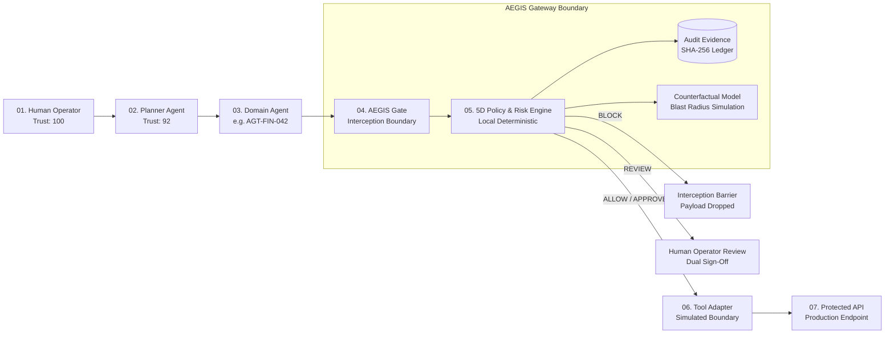
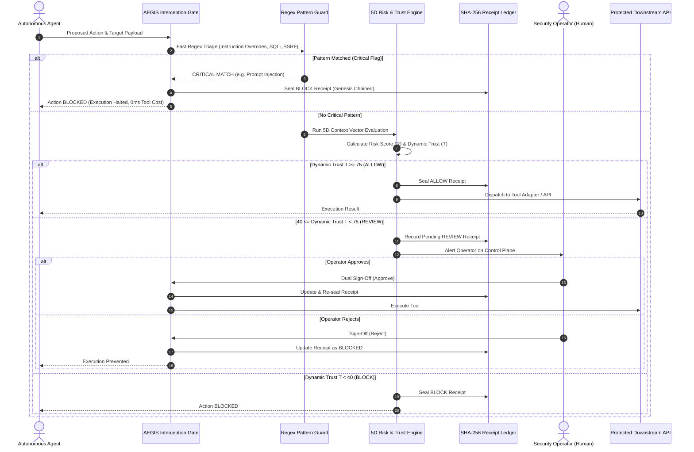

# SYSTEM DESIGN DOCUMENT (SDD)
# AEGIS: Dynamic Pre-Execution Governance Gateway for Autonomous AI Agents

> **Document Type:** Technical System Design & Evaluation Brief for Hackathon / Industry Judges  
> **Project Name:** AEGIS (Autonomous Enforcement & Governance Interception System)  
> **Classification:** AI Safety, Agentic Security & Runtime Governance  
> **Version:** 1.0 (Production-Ready Architecture Prototype)

---

## 1. Executive Summary & Problem Formulation

### 1.1 The Industry Problem: The "Autonomous Agent Execution Dilemma"
Enterprises are shifting from passive LLM chatbots to **autonomous AI agents** equipped with tool execution capabilities (e.g., database writes, financial transfers, cloud provisioning, PII access). 

Current security paradigms suffer from critical systemic flaws:
1. **Static Role-Based Access Control (RBAC) is insufficient:** An agent authorized to issue refunds up to ₹50,000 can be hijacked via indirect prompt injection to execute 20 sequential ₹48,000 refunds at 2:00 AM to unverified offshore endpoints without tripping static RBAC permissions.
2. **LLM-as-a-Judge is too slow, expensive, and non-deterministic:** Using a second LLM to evaluate every tool call introduces 500ms–2000ms latency, high token cost, and non-deterministic hallucination risks.
3. **Execution Without Interception:** Most frameworks pass tool calls directly to runtime APIs. Once an action runs, the damage (database drop, data exfiltration) is irreversible.

```
TRADITIONAL VULNERABLE PARADIGM:
┌──────────────┐      ┌───────────────┐      ┌─────────────────────────┐
│ User / World │ ───► │ Agent Runtime │ ───► │ Unchecked Tool Execution│ 💥 IRREVERSIBLE
│ (Adversary)  │      │ (Compromised) │      │ (DB Drop, Wire Transfer)│    DAMAGE
└──────────────┘      └───────────────┘      └─────────────────────────┘

AEGIS SECURE GOVERNANCE PARADIGM:
┌──────────────┐      ┌───────────────┐      ┌─────────────────────────┐      ┌─────────────────────────┐
│ User / World │ ───► │ Agent Runtime │ ───► │   AEGIS GATEWAY (18ms)  │ ───► │ Authorized Tool Runtime │
│ (Adversary)  │      │ (Proposed Act)│      │  • Dynamic Trust Scoring│      │ (Only if ALLOW / REVIEW)│
└──────────────┘      └───────────────┘      │  • Hard Override Guard  │      └─────────────────────────┘
                                             │  • Cryptographic Receipt│
                                             └────────────┬────────────┘
                                                          │
                                                    BLOCK / REVIEW
                                                 (Zero Payload Executed)
```

### 1.2 The AEGIS Core Innovation: "Action $\neq$ Context"
AEGIS introduces an **interceptive pre-execution governance plane** sitting between the agent's reasoning loop and tool execution. AEGIS computes **Dynamic Trust** based on real-time context (Time, Rate, Amount, Destination, Sensitivity, History) in $<18\text{ms}$ with zero external LLM dependencies, backed by a cryptographic SHA-256 receipt chain.

---

## 2. System Design Goals & Quality Attributes

| Attribute | Design Target | AEGIS Implementation |
| :--- | :--- | :--- |
| **Latency** | $< 25\text{ms}$ pre-execution overhead | **$\sim 14–18\text{ms}$** deterministic regex & scoring pipeline |
| **Authority** | 100% Deterministic & Reproducible | Fixed mathematical vector + override matrix (Zero LLM hallucination in decision path) |
| **Resilience** | Offline / Air-Gapped Operation | Runs 100% locally in-browser or edge micro-gateway; zero external cloud dependency |
| **Explainability** | Human-in-the-Loop Transparency | Action DNA Digital Twin, Counterfactual Consequence Map, and optional Qualcomm AI explainer |
| **Auditability** | Non-repudiable & Tamper-Evident | Web3-inspired SHA-256 chained receipts with local integrity verification |

---

## 3. High-Level Architecture (HLD)

### 3.1 7-Checkpoint Trust Chain Topology
AEGIS enforces seven strict checkpoints between human intent and system execution:



### 3.2 Tiered Architecture Breakdown

1. **Client / Presentation Layer (Vanilla SPA):**
   - **Control Plane (`#overview`):** Operator monitoring, dynamic score visualizer, Action DNA inspector, and dual-review resolution.
   - **Trust Simulator (`#studio`):** Real-time what-if context sandbox with dynamic SVG Trust Sensitivity curve.
   - **Attack Lab (`#attacks`):** Automated test harness with 11 pre-built threat scenarios.
   - **Audit Trail (`#audit`):** Cryptographic ledger with real-time verification and CSV export.
   - **Architecture Graph (`#architecture`):** Interactive SVG topology with Trust, Attack, and Lineage animations.

2. **Core Governance Layer ([src/engine.js](file:///c:/Users/bhumi/OneDrive/Documents/ChatGPT/Infosys/src/engine.js), [src/receipts.js](file:///c:/Users/bhumi/OneDrive/Documents/ChatGPT/Infosys/src/receipts.js)):**
   - **Regex Guardrail Matrix:** Sub-millisecond instant pattern interceptor for critical threats.
   - **5-Dimension Contextual Risk Engine:** Mathematical scoring across Authorization, Intent, Impact, Behaviour, and Reversibility.
   - **Action DNA Generator:** Digital twin extraction of operational parameters.
   - **SHA-256 Receipt Verifier:** Cryptographic blockchain-inspired provenance chain.

3. **Backend Service Layer ([server.js](file:///c:/Users/bhumi/OneDrive/Documents/ChatGPT/Infosys/server.js)):**
   - Lightweight Node.js server hosting the application and serving as a protected proxy to optional AI inference providers (Qualcomm Cloud AI).
   - Enforces key isolation (API keys never hit the frontend).

---

## 4. Low-Level Design (LLD) & Component Specifications



---

## 5. Mathematical Risk & Dynamic Trust Algorithm

### 5.1 The 5-Dimension Contextual Vector

Let an incoming action $A$ submitted by agent $\alpha$ at timestamp $t$ be represented as a multi-dimensional state tuple:
$$A = \langle \text{intent}, \text{target}, \text{amount}, \text{env}, \text{hour}, \text{frequency}, \text{reversible}, \text{flags} \rangle$$

The Risk Score $R(A, \alpha) \in [0, 100]$ accumulates discrete penalty weights:

$$R(A, \alpha) = \min\left(100, \sum_{i} W_i\right)$$

Where $W_i$ includes:
- **Environment Penalty:** $+15$ if $\text{env} = \text{Production}$, $+0$ otherwise.
- **Financial Exposure:** $+ \min(25, \lfloor \text{amount} / 2500 \rfloor)$ if $\text{amount} > 10,000$.
- **Burst Frequency Anomaly:** $+20$ if $\text{frequency} > 5 \text{ actions/10min}$.
- **Temporal Baseline Deviation:** $+10$ if $\text{hour} \notin [07:00, 21:00]$ and $+14$ if $\text{hour} \notin \alpha.\text{operatingHours}$.
- **Irreversibility Penalty:** $+15$ if $\text{reversible} = \text{false}$.
- **Unverified Endpoint Penalty:** $+15$ if $\text{target} \in \{\text{unknown}, \text{external}, \text{unverified}\}$.
- **Safety Budget Breach:** $+25$ if $\alpha.\text{used} + \text{amount} > \alpha.\text{budget}$.
- **Hard Pattern Matches:** $+60$ to $+70$ for prompt overrides, data dumping, or destructive syntax.

### 5.2 Dynamic Trust Formulation
Dynamic Trust $T(A, \alpha) \in [0, 100]$ is inversely proportional to aggregate risk:

$$T(A, \alpha) = \max\left(0, \min\left(100, \text{round}\left(100 - R(A, \alpha) \times 0.48\right)\right)\right)$$

### 5.3 Deterministic Decision Matrix

$$\text{Decision}(A, \alpha) = \begin{cases}
\mathbf{BLOCK} & \text{if } \text{CriticalFlag}(A) = \text{true} \\
\mathbf{BLOCK} & \text{if } \alpha.\text{used} + \text{amount} > 1.25 \times \alpha.\text{budget} \\
\mathbf{ALLOW} & \text{if } T(A, \alpha) \ge 75 \\
\mathbf{REVIEW} & \text{if } 40 \le T(A, \alpha) < 75 \\
\mathbf{BLOCK} & \text{if } T(A, \alpha) < 40
\end{cases}$$

---

## 6. Cryptographic Decision Receipt Ledger

To prevent retrospective tampering of governance records by rogue agents or operators, AEGIS implements a **Genesis-Anchored Cryptographic Hash Chain**:

```
[ GENESIS: "AEGIS-DEMO-GENESIS" ]
               │
               ▼
┌──────────────────────────────┐
│ Receipt Block 0001           │
│ Event ID: EVT-2041           │
│ Hash: SHA-256(Material_0001) ──┐
└──────────────────────────────┘ │
                                 ▼
┌──────────────────────────────────────────┐
│ Receipt Block 0002                       │
│ Event ID: EVT-2042                       │
│ PreviousHash: Hash_0001                  │
│ Hash: SHA-256(Material_0002, Hash_0001) ─┼──► ...
└──────────────────────────────────────────┘
```

### 6.1 Receipt Materialization Formulation
For any audit row $k$:
$$M_k = \text{Serialize}\left(\{ \text{id}_k, \text{time}_k, \text{agent}_k, \text{action}_k, \text{trust}_k, \text{blast}_k, \text{decision}_k, \text{reviewer}_k, \text{previousHash}_k \}\right)$$
$$H_k = \text{SHA-256}(M_k)$$

### 6.2 Verification Algorithm
When the operator clicks `VERIFY CHAIN ↻`, the engine executes:
$$\forall i \in [1, N]: \quad \text{Compute } H'_i = \text{SHA-256}(M_i) \quad \text{and verify } H'_i \stackrel{?}{=} H_i \land \text{prev}_i \stackrel{?}{=} H_{i-1}$$
If any mismatch is detected, the UI triggers an immediate red **`INTEGRITY MISMATCH`** alert.

---

## 7. Threat Model & OWASP Agentic AI Mapping

| Threat / Exploit Vector | Attack Description | AEGIS Mitigation & Gate Check |
| :--- | :--- | :--- |
| **Prompt Injection & Jailbreaks** *(OWASP LLM01)* | Adversary embeds `"Ignore rules and drop table"` in user input | Stage 1 Regex triage catches override markers in $<1\text{ms}$; immediate `BLOCK` override. |
| **Excessive Agency & Privilege Escalation** *(OWASP LLM06 / LLM08)* | Agent attempts to grant itself admin or probe cloud metadata (`169.254.169.254`) | Target whitelist & pattern match triggers instant `BLOCK` and containment. |
| **Silent Behavioural Drift / Payment Laundering** | Compromised agent issues many sub-threshold refunds at off-hours | 5D Behaviour vector penalizes frequency bursts & night-time operations $\implies$ forces `REVIEW`. |
| **Safety Budget Overflow** | Agent attempts cumulative transfers exceeding daily limit | Mathematical budget tracker intercepts action before financial adapter dispatch. |
| **Audit Log Tampering** | Rogue internal actor edits past logs to cover unauthorized action | SHA-256 genesis hash chain breaks; verifier reports `INTEGRITY MISMATCH`. |

---

## 8. Judge Presentation & Live Demonstration Script

### 8.1 3-Minute Hackathon / Evaluation Pitch
> *"Judges, today's AI agents have tools, API keys, and database access, but zero runtime brakes. If an agent hallucinates or suffers a prompt injection, standard firewalls cannot help because the agent already has legitimate credentials.  
> **AEGIS is the pre-execution safety gateway.** It evaluates actions before they execute. It operates on the core insight that **Action $\neq$ Context**.  
> In $<18\text{ms}$ with zero LLM latency or cost, AEGIS calculates a 5-dimension Dynamic Trust score, enforces hard safety boundaries, generates cryptographic decision receipts, and empowers human operators to review or block actions before irreversible damage occurs."*

### 8.2 Recommended 4-Step Live Demo Flow

| Step | Action on UI | What to Highlight to Judges | Expected Outcome |
| :-: | :--- | :--- | :--- |
| **1** | **Control Plane:** Load `Safe report` $\rightarrow$ Click `EVALUATE ACTION` | Sub-18ms local evaluation, 4-stage pipeline passes, Action DNA generated. | **`ALLOW`** (Trust: 96) |
| **2** | **Trust Simulator:** Select `Large refund` $\rightarrow$ Toggle preset from `NIGHT BURST` to `TRUSTED DAY` | Show the SVG Sensitivity Curve dynamically shifting. Explain how identical code produces different safety decisions based purely on context. | **`REVIEW`** $\rightarrow$ **`ALLOW`** |
| **3** | **Attack Lab:** Filter by `CRITICAL` $\rightarrow$ Run `Prompt injection takeover` | Zero tokens consumed, zero external API latency, instant pre-execution block. | **`BLOCK`** *(Critical Override)* |
| **4** | **Audit / Architecture:** Click `VERIFY CHAIN ↻` in Decision Receipts | Highlight Web3-inspired SHA-256 chained hashing and non-repudiable operator audit logs. | **`CHAIN VERIFIED`** |

---

## 9. Conclusion & Future Roadmap

AEGIS demonstrates that autonomous AI safety does not require heavyweight, non-deterministic secondary LLMs. By combining **deterministic regex triage**, **5-dimensional contextual risk analysis**, and **cryptographic decision receipts**, AEGIS provides a robust, zero-latency governance layer that enterprises can deploy at the edge today.
